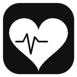
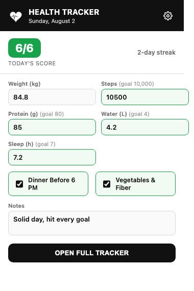
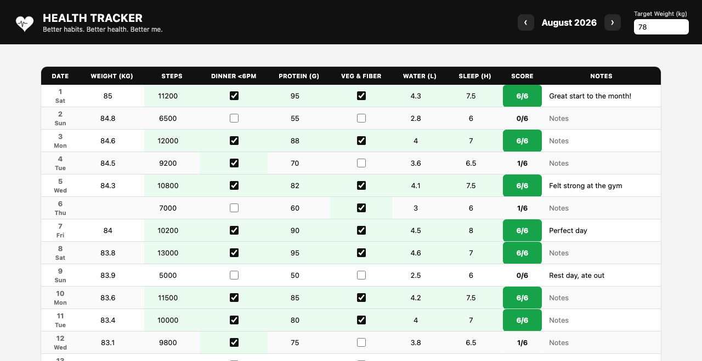
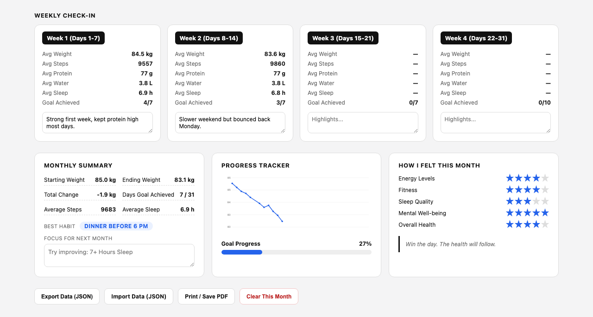
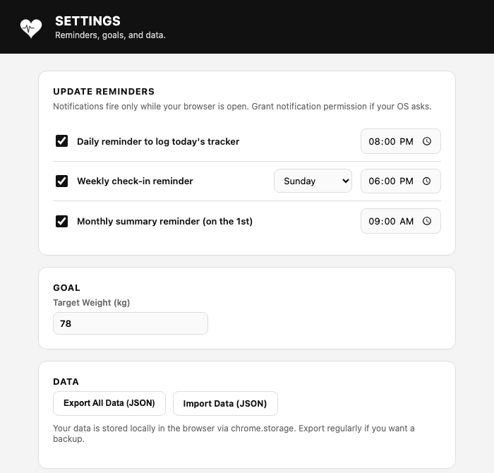

<p align="center">
  
</p>

<h1 align="center">Health Tracker</h1>
<p align="center"><i>Better habits. Better health. Better me.</i></p>

A Manifest V3 browser extension (Chrome / Edge / Brave) that turns the printable "Health Tracker" habit sheet into a living tool: log a few numbers a day, and it auto-scores your daily/weekly/monthly attendance, charts your weight, and reminds you when you forget to log.

Everything runs locally — there's no account, no server, and no data collection. All entries live in `chrome.storage.local` on your machine.

## Contents

- [Screenshots](#screenshots)
- [Features](#features)
- [Install](#install)
- [Usage guide](#usage-guide)
- [Data model & scoring](#data-model--scoring)
- [Reminders](#reminders)
- [Data ownership & privacy](#data-ownership--privacy)
- [Project structure](#project-structure)
- [Publishing to the Chrome Web Store](#publishing-to-the-chrome-web-store)

## Screenshots

**Toolbar popup** — quick daily entry, live score, and streak, without leaving the page you're on.



**Full dashboard** — the whole month as an editable table. Numbers you enter (steps, protein, water, sleep) are auto-checked against their goal and rolled into that row's score; no separate checkbox to babysit.



**Weekly check-in, monthly summary, progress chart, and monthly reflection** — all computed from the table above, live, as you type.



**Settings** — reminder schedule and target weight.



## Features

- **One-click popup logging** — weight, steps, protein, water, sleep, plus two checkboxes (dinner before 6 PM, veg & fiber). Auto-saves as you type.
- **Auto-scored daily/weekly/monthly attendance** — no manual averaging. A habit is "met" once its number clears its goal (10,000 steps / 80g protein / 4L water / 7h sleep), or its checkbox is checked. Daily score is met-habits out of 6.
- **Streaks** — the popup shows your current run of fully-completed (6/6) days.
- **Full dashboard** with month navigation, an editable table for every day, 4 weekly check-in cards (days 1–7 / 8–14 / 15–21 / 22–end), and an auto-computed monthly summary (starting/ending weight, total change, days-goal-achieved, best habit, and a suggested focus habit for next month).
- **Weight progress chart + goal progress bar**, computed from whatever weight entries you've logged and the target weight you set.
- **"How I felt this month"** — 5-star ratings for energy, fitness, sleep quality, mental well-being, and overall health.
- **Update reminders** — independent daily / weekly / monthly notification schedules, each with its own time (and weekday, for the weekly one). The daily reminder skips itself once that day is already fully logged.
- **Export / Import (JSON)** and **Print / Save PDF**, so your data is never locked in.
- No build step — plain HTML/CSS/JS, load it straight into the browser.

## Install

This isn't on the Chrome Web Store yet (see [Publishing](#publishing-to-the-chrome-web-store)), so for now install it in developer mode:

1. Clone or download this repo.
2. Open `chrome://extensions` (or `edge://extensions`).
3. Turn on **Developer mode** (top-right toggle).
4. Click **Load unpacked** and select the repo folder.
5. Click the puzzle-piece icon in the toolbar and pin **Health Tracker** so it stays visible.

After editing any file, click the reload icon on the extension's card in `chrome://extensions` to pick up changes.

## Usage guide

**Logging a day.** Click the toolbar icon. Fill in whatever you've got — you don't need every field every day. Fields with a goal (steps/protein/water/sleep) turn green once you clear the threshold; checkboxes do too. Your score updates live, and the entry saves automatically (no save button).

**Opening the full tracker.** Click **Open Full Tracker** in the popup, or right-click the toolbar icon → *Options* for settings specifically. The dashboard opens as a normal tab so you have room to work.

**Editing history.** In the dashboard, every cell in the month table is editable — click into any day, past or future, and type. Use the **‹ ›** arrows next to the month label to move between months; each month keeps its own data.

**Weekly check-ins & monthly reflection.** Scroll below the table for the four weekly cards (averages + a free-text highlights box) and the monthly summary card. The "Best Habit" pill and the "Focus for Next Month" placeholder are computed from that month's completion rates — the focus box is editable if you'd rather write your own.

**Progress chart & goal.** Set a **Target Weight** at the top of the dashboard (or in Settings). The chart plots every day you've logged a weight; the goal-progress bar compares your first vs. most recent weight against that target.

**Reminders.** Open Settings (gear icon in the popup) and turn on any of: a daily reminder to log today, a weekly reminder (pick the day) to do your check-in, or a monthly reminder (fires on the 1st) to review last month. Chrome will ask for notification permission the first time one fires.

**Backing up.** Use **Export Data (JSON)** (in the dashboard or Settings) any time you want a snapshot; **Import Data (JSON)** restores from one. Since everything is local to the browser profile, exporting is also how you'd move data to another machine.

## Data model & scoring

Each day is stored under its ISO date (`YYYY-MM-DD`):

```json
{
  "date": "2026-08-05",
  "weight": 84.3,
  "steps": 10800,
  "protein": 82,
  "water": 4.1,
  "sleep": 7.5,
  "dinner": true,
  "veg": true,
  "notes": "Felt strong at the gym"
}
```

A habit counts as **met** when its number clears its goal (steps ≥ 10,000, protein ≥ 80g, water ≥ 4L, sleep ≥ 7h) or its checkbox is checked. Daily score = met-habits out of 6. Weekly and monthly views aggregate straight from these entries — averages, days-goal-achieved, best/focus habit, and the chart are all derived, never hand-entered.

## Reminders

Notifications only fire while the browser is running (this is a local extension, not a server — there's no push when the browser is closed). A single background alarm checks every 60 minutes for reminders that are due, so a reminder can fire up to ~an hour after its scheduled time. Each reminder type (daily/weekly/monthly) only notifies once per its own period, even though the check runs hourly.

## Data ownership & privacy

- All data is stored in `chrome.storage.local` — it never leaves your browser profile, and this extension makes no network requests.
- There's no account, no analytics, no third-party service.
- See [PRIVACY.md](PRIVACY.md) for the full privacy policy (also linked from the Chrome Web Store listing).

## Project structure

```
manifest.json         MV3 manifest
background.js         service worker: reminder alarm + notifications
popup/                toolbar popup (today's quick entry)
dashboard/             full tracker (month table, weekly/monthly, chart)
options/               settings page (reminders, target weight, data)
shared/                data model, scoring math, chrome.storage helpers
icons/                 16/32/48/128 toolbar + store icons
screenshots/           images used in this README / store listing
```

## Publishing to the Chrome Web Store

See [PUBLISHING.md](PUBLISHING.md) for the full walkthrough (packaging, store listing copy, screenshots, and submission steps).
